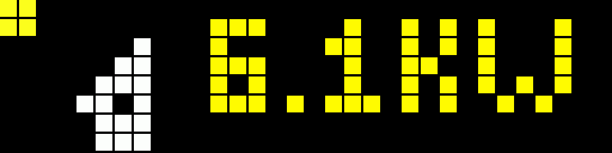
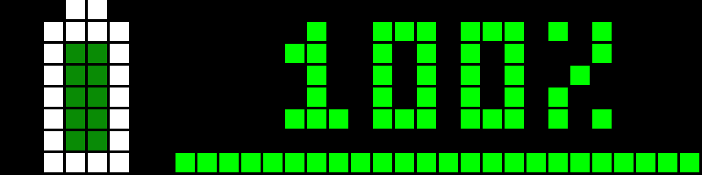

# HA Blueprints

Collection of Home Assistant automation blueprints for AWTRIX / SVITRIX displays.

## Included Blueprints

- `solarpower.yaml`
  - Solar Power Monitor for current solar production.
  - Displays watts or kilowatts with color-coded icons.
  - Supports optional night filtering and hide-at-zero behavior.
  - Optional display loop position via `pos`.
  

- `solarbattery.yaml`
  - Solar Battery Status for PV battery charge level.
  - Shows percentage with colored icons and progress bar.
  - Optional display loop position via `pos`.
  

## Import Links

- `solarpower.yaml`:
  
- `solarbattery.yaml`:
  

Use these buttons to open the Home Assistant blueprint import page directly.

## Requirements

- Home Assistant with automation-blueprint support.
- AWTRIX / SVITRIX device(s) connected via MQTT.
- MQTT integration and home assistant device discovery.
- Required icons installed on the device(s).

### Required icons

- `solarpower.yaml`:
  - 54156 (solar-green)
  - 50557 (solar-white-dyn)
  - 50556 (solar-static)
  - 54876 (Solar Power Night Light)

- `solarbattery.yaml`:
  - 6358 (battery full)
  - 6356 (battery medium)
  - 6354 (battery empty)

## Usage

1. Copy the blueprint files to your Home Assistant `blueprints/automation/` folder.
2. Reload blueprints in Home Assistant.
3. Create an automation from the blueprint.
4. Select the AWTRIX / SVITRIX device and appropriate sensor.
5. Adjust thresholds and optional display position as needed.

---

# Deutsche Zusammenfassung

Sammlung von Home Assistant Blueprints für AWTRIX / SVITRIX Displays.

- `solarpower.yaml`: Zeigt die aktuelle Solarproduktion als Watt / Kilowatt an.
- `solarbattery.yaml`: Zeigt den Ladezustand der PV-Batterie in Prozent an.

Voraussetzungen:
- Home Assistant mit MQTT
- AWTRIX / SVITRIX Gerät
- Benötigte Icons auf dem Display installiert
